# 안전하길 ERD — FINAL v8

> 기준: `database/baseline/01_schema.sql` FINAL v8  
> DB: **Supabase Auth + PostgreSQL + PostGIS + pgRouting**  
> Public Core: **22 tables / 225 columns / 31 FK / 9 spatial columns**
>
> 이 문서는 GitHub에서 바로 볼 수 있도록 **Mermaid ER Diagram**으로 작성했습니다.
> 가독성을 위해 다이어그램에는 **PK/FK와 핵심 컬럼**을 표시하고, 전체 CHECK/DEFAULT는 `database/baseline/01_schema.sql`을 최종 기준으로 봅니다.

## 1. 핵심 설계 원칙

- `auth.users`는 Supabase가 관리하며 직접 생성하지 않습니다.
- 사용자와 관리자의 시스템 ID는 모두 `auth.users.id` UUID를 사용합니다.
- React는 public table을 직접 CRUD하지 않고 Express `/api`를 거칩니다.
- Core 22 table은 RLS를 활성화하고 `anon/authenticated` 직접 CRUD를 차단합니다.
- 경로 계산은 `POST 202 → GET Polling` 방식입니다.
- 경로 후보는 `safe / fastest / shortest` 3종입니다.
- 재탐색은 기존 row 수정이 아니라 **새 `route_requests` row**를 생성합니다.
- Navigation step/session은 DB에 저장하지 않고 Runtime에서 생성합니다.
- 서비스 허용 영역은 `service_areas.geom`과 출발/도착 좌표를 `ST_Covers`로 판정하며 `route_requests`에 service_area FK를 저장하지 않습니다.

## 2. Mermaid ERD

```mermaid
erDiagram
    AUTH_USERS {
        uuid id PK
    }

    USERS {
        uuid id PK,FK
        string username
        string email
        string nickname
        string signup_provider
        boolean is_active
        boolean onboarding
        timestamp withdrawn_at
        timestamp created_at
        timestamp updated_at
    }

    USER_TERM_AGREEMENTS {
        uuid user_id PK,FK
        timestamp agreed_at
    }

    DRIVING_PREFERENCES {
        uuid user_id PK,FK
        int intersection_score
        int pedestrian_zone_score
        int narrow_road_score
        int turn_conflict_score
        int structure_score
        timestamp updated_at
    }

    FAVORITE_PLACES {
        uuid id PK
        uuid user_id FK
        string place_type
        string place_name
        string custom_name
        geometry geom
        string provider
        string provider_place_id
    }

    RECENT_SEARCHES {
        bigint id PK
        uuid user_id FK
        string place_name
        geometry geom
        string provider
        string provider_place_id
        timestamp searched_at
    }

    ADMINS {
        uuid id PK,FK
        string email
        string role
        boolean is_active
        uuid granted_by_admin_id FK
        timestamp granted_at
        timestamp revoked_at
    }

    ADMIN_AUDIT_LOGS {
        bigint id PK
        uuid actor_admin_id FK
        uuid target_admin_id FK
        string action
        json before_data
        json after_data
        timestamp created_at
    }

    DATASETS {
        bigint id PK
        string code UK
        string name
        string source_name
        string update_method
        boolean is_active
    }

    DATA_UPDATE_LOGS {
        uuid id PK
        bigint dataset_id FK
        string status
        string trigger_type
        int processed_count
        int success_count
        int failure_count
        string source_version
        uuid executed_by FK
        timestamp started_at
        timestamp finished_at
    }

    SERVICE_AREAS {
        bigint id PK
        string area_code UK
        string name
        geometry geom
        boolean is_active
        date effective_from
        date effective_to
    }

    ROAD_NODES {
        bigint id PK
        string node_id UK
        geometry geom
        string node_type
        boolean is_intersection
    }

    ROAD_LINKS {
        bigint id PK
        string link_id UK
        bigint from_node_id FK
        bigint to_node_id FK
        geometry geom
        string road_name
        string road_class
        int lane_count
        decimal length_m
        decimal base_time_sec
        int speed_limit_kph
        boolean one_way
    }

    ROAD_TURNS {
        bigint id PK
        bigint via_node_id FK
        bigint from_road_link_id FK
        bigint to_road_link_id FK
        string turn_type
        boolean is_allowed
        decimal penalty_sec
    }

    ROAD_LINK_FEATURES {
        bigint road_link_id PK,FK
        decimal complex_intersection_score
        decimal pedestrian_zone_score
        decimal narrow_road_score
        decimal turn_conflict_score
        decimal structure_score
        decimal accident_score
        string feature_version
    }

    ROAD_RISK_SCORES {
        bigint road_link_id PK,FK
        string risk_version PK
        int time_bucket PK
        string model_version
        decimal objective_risk_score
        decimal risk_cost
        uuid generated_by_update_log_id FK
    }

    TRAFFIC_ACCIDENTS {
        bigint id PK
        string taas_accident_id UK
        timestamp occurred_at
        geometry geom
        string accident_type
        string severity
        int accident_count
        bigint matched_road_link_id FK
        decimal match_confidence
        json raw_payload
    }

    ROUTING_POLICIES {
        uuid id PK
        string version UK
        json survey_weight_map
        decimal objective_weight
        decimal preference_weight
        string normalization_method
        json config
        boolean is_active
        timestamp effective_from
    }

    ROUTE_REQUESTS {
        uuid id PK
        uuid user_id FK
        uuid navigation_run_id
        uuid parent_request_id FK
        string request_type
        string reroute_reason
        geometry origin_geom
        bigint origin_node_id FK
        geometry destination_geom
        bigint destination_node_id FK
        int max_detour_minutes
        uuid routing_policy_id FK
        string risk_version
        json preference_snapshot
        string status
        string failure_code
        string input_fingerprint
        timestamp created_at
    }

    ROUTE_CANDIDATES {
        uuid id PK
        uuid route_request_id FK
        string route_type
        int estimated_seconds
        int distance_meters
        decimal detour_minutes
        decimal objective_risk_cost
        decimal preference_penalty
        decimal total_routing_cost
        json recommendation_reasons
        geometry geom
        boolean is_selected
        timestamp selected_at
    }

    ROUTE_CANDIDATE_LINKS {
        uuid route_candidate_id PK,FK
        int seq PK
        bigint road_link_id FK
        decimal segment_distance_m
        int segment_seconds
        decimal segment_cost
    }

    NOTICES {
        bigint id PK
        string title
        text content
        boolean is_published
        timestamp published_at
        uuid created_by FK
    }

    INQUIRIES {
        uuid id PK
        uuid user_id FK
        string category
        string title
        text content
        string status
        text answer_content
        uuid answered_by FK
        timestamp created_at
        timestamp answered_at
    }

    AUTH_USERS ||--o| USERS : "service profile"
    AUTH_USERS ||--o| ADMINS : "admin profile"

    USERS ||--o| USER_TERM_AGREEMENTS : agrees
    USERS ||--o| DRIVING_PREFERENCES : configures
    USERS ||--o{ FAVORITE_PLACES : saves
    USERS ||--o{ RECENT_SEARCHES : searches
    USERS ||--o{ ROUTE_REQUESTS : requests
    USERS ||--o{ INQUIRIES : asks

    ADMINS o|--o{ ADMINS : grants
    ADMINS o|--o{ ADMIN_AUDIT_LOGS : acts
    ADMINS o|--o{ ADMIN_AUDIT_LOGS : targets
    ADMINS o|--o{ DATA_UPDATE_LOGS : executes
    ADMINS o|--o{ NOTICES : creates
    ADMINS o|--o{ INQUIRIES : answers

    DATASETS ||--o{ DATA_UPDATE_LOGS : has
    DATA_UPDATE_LOGS o|--o{ ROAD_RISK_SCORES : generates

    ROAD_NODES ||--o{ ROAD_LINKS : from_node
    ROAD_NODES ||--o{ ROAD_LINKS : to_node
    ROAD_NODES ||--o{ ROAD_TURNS : via_node

    ROAD_LINKS ||--o{ ROAD_TURNS : from_link
    ROAD_LINKS ||--o{ ROAD_TURNS : to_link
    ROAD_LINKS ||--o| ROAD_LINK_FEATURES : feature
    ROAD_LINKS ||--o{ ROAD_RISK_SCORES : risk
    ROAD_LINKS o|--o{ TRAFFIC_ACCIDENTS : matched
    ROAD_LINKS ||--o{ ROUTE_CANDIDATE_LINKS : composes

    ROUTING_POLICIES o|--o{ ROUTE_REQUESTS : applies
    ROAD_NODES o|--o{ ROUTE_REQUESTS : origin_snap
    ROAD_NODES o|--o{ ROUTE_REQUESTS : destination_snap
    ROUTE_REQUESTS o|--o{ ROUTE_REQUESTS : reroute_parent
    ROUTE_REQUESTS ||--o{ ROUTE_CANDIDATES : produces
    ROUTE_CANDIDATES ||--o{ ROUTE_CANDIDATE_LINKS : contains
```



## 3. Core 22 Table 역할

| 영역 | Table | 역할 |
|---|---|---|
| 회원 | `users` | Supabase Auth 사용자와 연결되는 서비스 프로필 |
| 회원 | `user_term_agreements` | 필수 3종 약관 전체 동의 완료 시각 |
| 회원 | `driving_preferences` | 5개 운전 부담 설문 원점수 1~5 |
| 장소 | `favorite_places` | 집/회사/일반 저장 장소 |
| 장소 | `recent_searches` | 사용자가 실제 선택한 최근 Kakao 장소 |
| 라우팅 | `routing_policies` | 원점수→가중치, 객관/개인화 비율 버전 |
| 라우팅 | `route_requests` | 최초/재탐색/실패/미지원 포함 모든 경로 요청 |
| 라우팅 | `route_candidates` | safe/fastest/shortest 후보 |
| 라우팅 | `route_candidate_links` | 후보를 구성하는 도로 링크 순서 |
| 관리자 | `admins` | Supabase Auth 관리자 권한 프로필 |
| 관리자 | `admin_audit_logs` | 관리자 생성/권한/상태 변경 감사 로그 |
| 데이터 | `datasets` | TAAS/NODE/LINK/TURN/FEATURE/RISK 데이터셋 master |
| 데이터 | `data_update_logs` | 데이터 갱신 실행/상태/건수/버전 이력 |
| 공간 | `service_areas` | 사용자 서비스 허용 행정영역 |
| 도로망 | `road_nodes` | 표준노드링크 Node |
| 도로망 | `road_links` | 표준노드링크 Link |
| 도로망 | `road_turns` | Link→Link 회전/유턴/금지 관계 |
| 모델 | `road_link_features` | 설문 5요소·사고 대응 링크 feature |
| 모델 | `road_risk_scores` | 링크별 객관 위험 사전계산 결과 |
| 사고 | `traffic_accidents` | TAAS 사고 + 도로링크 매칭 |
| 지원 | `notices` | 사용자 공지 + 관리자 CRUD |
| 지원 | `inquiries` | 사용자 문의 + 관리자 답변 |

## 4. FK 31개 체크리스트

| # | Child FK | Parent | 삭제 정책 |
|---:|---|---|---|
| 1 | `users.id` | `auth.users.id` | CASCADE |
| 2 | `user_term_agreements.user_id` | `users.id` | CASCADE |
| 3 | `driving_preferences.user_id` | `users.id` | CASCADE |
| 4 | `favorite_places.user_id` | `users.id` | CASCADE |
| 5 | `recent_searches.user_id` | `users.id` | CASCADE |
| 6 | `admins.id` | `auth.users.id` | CASCADE |
| 7 | `admins.granted_by_admin_id` | `admins.id` | SET NULL |
| 8 | `admin_audit_logs.actor_admin_id` | `admins.id` | SET NULL |
| 9 | `admin_audit_logs.target_admin_id` | `admins.id` | SET NULL |
| 10 | `data_update_logs.dataset_id` | `datasets.id` | RESTRICT |
| 11 | `data_update_logs.executed_by` | `admins.id` | SET NULL |
| 12 | `road_links.from_node_id` | `road_nodes.id` | RESTRICT |
| 13 | `road_links.to_node_id` | `road_nodes.id` | RESTRICT |
| 14 | `road_turns.via_node_id` | `road_nodes.id` | CASCADE |
| 15 | `road_turns.from_road_link_id` | `road_links.id` | CASCADE |
| 16 | `road_turns.to_road_link_id` | `road_links.id` | CASCADE |
| 17 | `road_link_features.road_link_id` | `road_links.id` | CASCADE |
| 18 | `road_risk_scores.road_link_id` | `road_links.id` | CASCADE |
| 19 | `road_risk_scores.generated_by_update_log_id` | `data_update_logs.id` | SET NULL |
| 20 | `traffic_accidents.matched_road_link_id` | `road_links.id` | SET NULL |
| 21 | `route_requests.user_id` | `users.id` | CASCADE |
| 22 | `route_requests.parent_request_id` | `route_requests.id` | SET NULL |
| 23 | `route_requests.origin_node_id` | `road_nodes.id` | SET NULL |
| 24 | `route_requests.destination_node_id` | `road_nodes.id` | SET NULL |
| 25 | `route_requests.routing_policy_id` | `routing_policies.id` | RESTRICT |
| 26 | `route_candidates.route_request_id` | `route_requests.id` | CASCADE |
| 27 | `route_candidate_links.route_candidate_id` | `route_candidates.id` | CASCADE |
| 28 | `route_candidate_links.road_link_id` | `road_links.id` | RESTRICT |
| 29 | `notices.created_by` | `admins.id` | SET NULL |
| 30 | `inquiries.user_id` | `users.id` | CASCADE |
| 31 | `inquiries.answered_by` | `admins.id` | SET NULL |

## 5. FK가 아닌 공간 관계

### `service_areas` ↔ `route_requests`

`route_requests`에는 `service_area_id`를 저장하지 않습니다.

```sql
ST_Covers(service_areas.geom, route_requests.origin_geom)
ST_Covers(service_areas.geom, route_requests.destination_geom)
```

- 출발/도착 모두 active service area 안 → 계산 진행
- 지역 밖 → `status='rejected'`
- `failure_code='OUT_OF_SERVICE_AREA'`
- `origin_admin_code/name`, `destination_admin_code/name`은 확장 지역 수요 집계에 사용

## 6. 경로 처리 관계

```text
사용자 장소 선택
    ↓
route_requests
    ↓ service area 판정
    ↓ road_nodes snap
    ↓ driving_preferences + routing_policies
    ↓ road_link_features + road_risk_scores
    ↓ road_links + road_turns + pgRouting
route_candidates (safe / fastest / shortest)
    ↓
route_candidate_links
    ↓
Navigation Runtime step 생성
    ↓
경로 이탈 시 새 route_requests 생성
```

`route_requests.parent_request_id`와 `navigation_run_id`가 재탐색 체인을 연결합니다.

## 7. 주요 Unique/도메인 규칙

- Local `users.username`: NULL이 아닐 때 unique
- `favorite_places`: 사용자별 `home` 1개, `work` 1개
- 즐겨찾기 전체 최대 5개: Backend transaction에서 검증
- `recent_searches`: 같은 Kakao 장소는 Upsert, 최신 20개 유지
- `routing_policies`: `is_active=true` 1개
- `route_candidates`: `(route_request_id, route_type)` unique
- 한 request의 `is_selected=true` 후보는 최대 1개
- `road_turns`: `(via_node_id, from_road_link_id, to_road_link_id)` unique
- `road_risk_scores`: `(road_link_id, risk_version, time_bucket)` composite PK

## 8. 공간 컬럼 9개

| Table | Column | Type |
|---|---|---|
| `favorite_places` | `geom` | `geometry(Point,4326)` |
| `recent_searches` | `geom` | `geometry(Point,4326)` |
| `service_areas` | `geom` | `geometry(MultiPolygon,4326)` |
| `road_nodes` | `geom` | `geometry(Point,4326)` |
| `road_links` | `geom` | `geometry(LineString,4326)` |
| `traffic_accidents` | `geom` | `geometry(Point,4326)` |
| `route_requests` | `origin_geom` | `geometry(Point,4326)` |
| `route_requests` | `destination_geom` | `geometry(Point,4326)` |
| `route_candidates` | `geom` | `geometry(LineString,4326)` |

모두 공간 조회가 필요한 컬럼이므로 `database/baseline/02_indexes.sql`의 GiST index를 유지합니다.

## 9. DB에 만들지 않는 객체

아래는 현재 FINAL 범위에서 의도적으로 제외합니다.

| 제외 객체 | 이유 |
|---|---|
| `auth_accounts` | Supabase Auth identities가 담당 |
| `user_sessions` | Supabase Auth session이 담당 |
| `admin_sessions` | Supabase Auth session이 담당 |
| `email_verifications` | Supabase Email OTP가 담당 |
| `terms` | 약관 본문/버전은 Frontend 정적 관리 |
| `road_reports` | 신고 기능 MVP 삭제 |
| `navigation_sessions` | Navigation 상태는 Runtime |
| `route_guidance_steps` | links + turns로 Runtime 생성 |
| `traffic_snapshots` | 실시간 교통 MVP 제외 |

## 10. API와 ERD 연결 기준

- `/api/users/*` → `users`, `user_term_agreements`
- `/api/driving-preferences` → `driving_preferences`
- `/api/favorites`, `/api/recent-searches` → 장소 2 table
- `/api/routes/*` → 라우팅/도로망/위험도 table
- `/api/notices`, `/api/inquiries` → 지원 table
- `/api/admin/dashboard/*` → `users`, `route_requests`, `data_update_logs` 집계
- `/api/admin/datasets/*` → `datasets`, `data_update_logs`
- `/api/admin/admins/*` → Supabase Auth Admin API + `admins`, `admin_audit_logs`

---

**최종 기준:** 실제 DB DDL 수정이 발생하면 먼저 migration SQL을 추가하고, 그 migration이 확정된 뒤 이 `ERD.md`를 함께 수정합니다.
